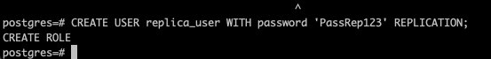
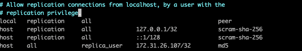
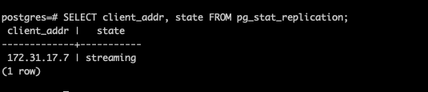
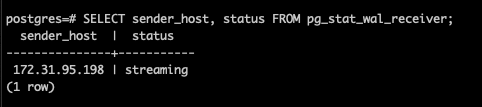
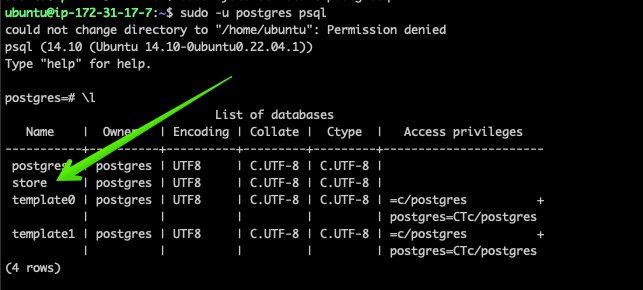
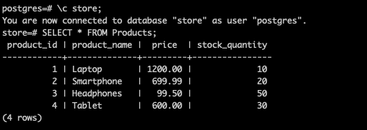
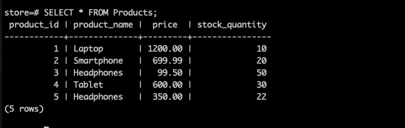

# Реплікація та шардування баз даних

Так як в лекції використовувалась база MySQL і щоб повністю покроково не повторяти кроки по виконанню з лекції, я вирішив використати базу даних PostgreSQL, попередньо створивши два EC2 інстанса з проінстальованими на запущеними postgresql базами даних.

## Створення бази даних і таблиць:
Створили базу даних Store.

Наповнили базу даних таблицями з даними 

## Конфігурація основного сервера (master):

Створюємо обліковий запис користувача для реплікації

Вказуємо приватну IP адресу сервера master бази в файлі конфігурації postgresql.conf

Вмикаємо логування

Додаємо запис про користувача з правами на реплікацію у файлі pg\_hba.conf

## Налаштування вторинного сервера (slave):

Зупиняємо і очищаємо базу postgress на slave сервері для того щоб підготувати для синізації з master базою

## З'єднання slave з master:

Виконуємо команду копіювання даних дампу бази на сервер репліки

## Перевірка статусу реплікації:

Перевіряємо на мастер сервері чи репліка працює отримавши дані з таблиці pg\_stat\_replication

Також на стороні репліки отримуєму дані про мастер базу з таблиці pg\_stat\_wal\_receiver;

Додаємо новий запис в мастер базу

Бачимо що запис також є в репліці, отже наші бази даних синхронізуються.

## Симуляція збою мастера: 

При відключеному мастер сервері бачимо що репліка працює як і до цього, є доступ до бази.

Після увімкнення мастер сервера, робимо зміни до бази і перевіряємо чи є синхронізація з реплікою.  Добавляємо ще один рядок до таблиці Products з мастера і бачимо що новий рядок також зʼявився в репліці, отже синхронізація працює.

